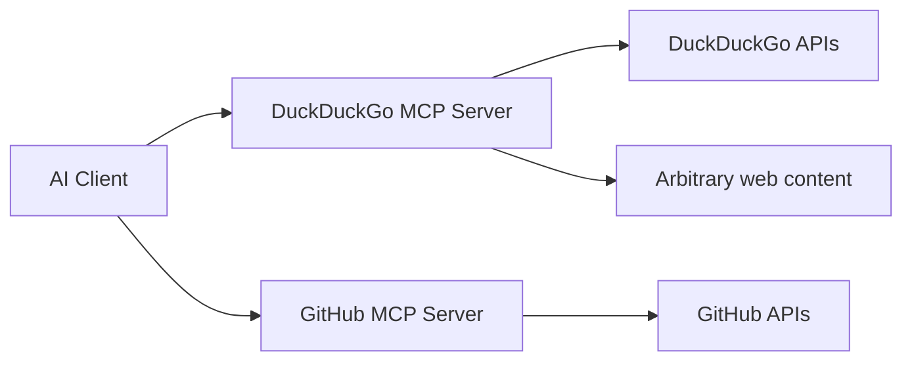
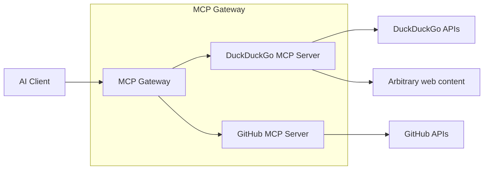

# Introduction

👋 Welcome to the **Docker MCP Gateway** lab! During this lab, you will learn to do the following:

- Learn about the Docker MCP Gateway
- Learn how to run the MCP Gateway with a simple MCP server
- Securely inject secrets into MCP servers
- Filter tools to reduce noise and save tokens
- Learn how to connect the MCP Gateway to your application using popular agentic frameworks

Throughout this session, you'll also learn how to use the [MCP Inspector](https://github.com/modelcontextprotocol/inspector) to interact with MCP servers and debug/troubleshoot potential issues.

## 🙋 What is MCP again?

**Model Context Protocol (MCP)** standardizes how AI applications connect to external data sources and tools.  

It provides the ability to package and distribute common tools you might need in AI workflows. Examples might include:

- Retrieve data from GitHub about open issues or pull requests
- Lookup customer or subscription information from Stripe
- Create a Notion page with summarized details
- Send an email using Resent
- Or more!

By using MCP, it allows you to easily extend or add capabilities to your AI applications.

## Why a MCP Gateway?

When running MCP servers, you often want a single connection point for your application to send all MCP requests. This allows you to **audit** and **log** more easily, **configure** more securely, and more.

By using a MCP Gateway, your application also needs only a single MCP connection, making your architecture look similar to the following:

The **[Docker MCP Gateway](https://github.com/docker/mcp-gateway)** is an open-source gateway that makes it simple, safe, and secure to run MCP servers inside containers.

Docker additionally provides a **[MCP Catalog](https://hub.docker.com/mcp)**, which is a collection of containerized MCP servers that are easy to get up and going.

With that, let's get started by starting the MCP Gateway with a simple MCP server!
